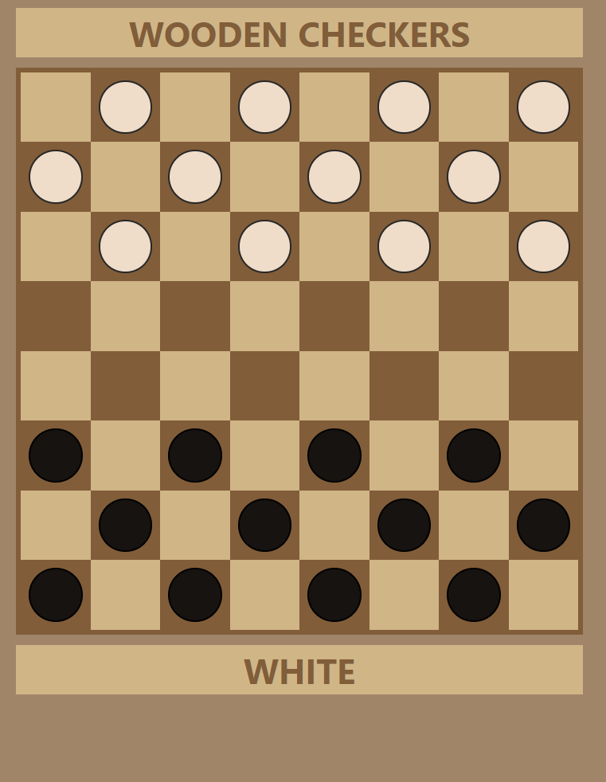

# checkers

## Table of contents
* [General info](#general-info)
* [Technologies](#technologies)
* [Features](#features)

## General info
This project is a simple checkers game made in a free time.
	
## Technologies
Project is created with:
* JavaScript
* CSS3
* HTML5

## Features
* A board and pawns are generating in JS
* White and black move pawns alternately
* A player can capture opponent's pawn (multiple times)
* Captured pawns are shown under the board
* There is a message whose move is now or who won under the board
#### To do:
* If a player is able to capture, jump must be made
